<!-- Hero Section -->
<div align="center">


<br><br>


<br>

**Transform your WhatsApp into a productivity powerhouse with AI that understands natural language**

[🚀 Features](#-features) • [🏗️ Architecture](#️-architecture) • [💻 Tech Stack](#-tech-stack) • [🎯 Use Cases](#-use-cases)

</div>

---


<!-- About -->
## 💬 **About Aivy**

<table>
<tr>
<td width="60%">

### 🤖 **Your Personal AI Assistant**

**Aivy** is an AI-powered WhatsApp assistant that transforms your messaging app into a **comprehensive scheduling and productivity tool**. Using natural language processing, Aivy understands your commands and manages your appointments seamlessly.

**Core Value Proposition:**
- 📅 Schedule appointments with natural language
- 🔔 Automatic smart reminders
- 🤖 AI that truly understands you
- ⚡ No complex forms or interfaces
- 📱 Everything in WhatsApp

**Perfect for:** Professionals, entrepreneurs, busy individuals, teams, and anyone who wants to stay organized effortlessly.

</td>
<td width="40%">


</td>
</tr>
</table>


<!-- Features -->
## 🚀 **Features**

<div align="center">

### **Comprehensive Scheduling & Productivity**

</div>

<table>
<tr>
<td width="50%">

### 📅 **Smart Scheduling**

- 💬 **Natural Language**: "Schedule meeting for tomorrow at 2pm"
- 🎯 **Instant Understanding**: AI interprets your intent
- ⚡ **Quick Creation**: No forms, just text
- 📝 **Automatic Parsing**: Date, time, and details extracted
- 🔄 **Easy Editing**: Modify or cancel with simple commands

</td>
<td width="50%">

### 🔔 **Intelligent Reminders**

- ⏰ **Multi-Level Alerts**: 1 day, 1 hour, 15 minutes before
- 🤖 **Smart Timing**: Customizable reminder intervals
- 📱 **WhatsApp Notifications**: Direct to your phone
- 🎯 **Context-Aware**: Relevant information in each reminder
- ✅ **Confirmation**: Always know what's scheduled

</td>
</tr>
<tr>
<td width="50%">

### 🤖 **AI Intelligence**

- 🧠 **NLP Processing**: Understands natural language
- 🎭 **Context Recognition**: Interprets intent accurately
- 🔮 **Smart Suggestions**: Recommends optimal times
- 📊 **Pattern Learning**: Adapts to your habits
- 💡 **Proactive Help**: Anticipates your needs

</td>
<td width="50%">

### 🔧 **Productivity Tools**

- 📤 **Calendar Export**: Google Calendar, Outlook integration
- 📋 **Agenda View**: See your week at a glance
- 🔍 **Quick Search**: Find appointments instantly
- 🏷️ **Categorization**: Organize by type or priority
- 📊 **Analytics**: Track your schedule patterns

</td>
</tr>
</table>

### 💬 **Example Commands**

<div align="center">

```
"Schedule meeting for tomorrow at 2pm"
"Remind me to call client at 3pm"
"Cancel my meeting tomorrow"
"Show my schedule for the week"
"Reschedule Friday's appointment to Monday"
```

</div>


<!-- Tech Stack -->
## 💻 **Tech Stack**

<div align="center">

### **Modern Frontend Architecture**

<table>
<tr>
<td align="center" width="25%">

### ⚛️ **React**


**React 18.3**  
Modern hooks & components

</td>
<td align="center" width="25%">

### 📘 **TypeScript**


**TypeScript 5.5**  
Type-safe development

</td>
<td align="center" width="25%">

### 🎨 **Tailwind CSS**


**Tailwind 3.4**  
Utility-first styling

</td>
<td align="center" width="25%">

### ⚡ **Vite**


**Vite 5.4**  
Lightning-fast builds

</td>
</tr>
</table>

### 🔧 **Development Tools**


</div>

### 📦 **Key Technologies**

<table>
<tr>
<th>Category</th>
<th>Technology</th>
<th>Purpose</th>
</tr>
<tr>
<td><b>Framework</b></td>
<td>React 18.3</td>
<td>UI library with modern features</td>
</tr>
<tr>
<td><b>Language</b></td>
<td>TypeScript 5.5</td>
<td>Type safety & better DX</td>
</tr>
<tr>
<td><b>Styling</b></td>
<td>Tailwind CSS 3.4</td>
<td>Utility-first CSS framework</td>
</tr>
<tr>
<td><b>Build Tool</b></td>
<td>Vite 5.4</td>
<td>Fast dev server & bundler</td>
</tr>
<tr>
<td><b>CSS Processing</b></td>
<td>PostCSS</td>
<td>CSS transformations</td>
</tr>
<tr>
<td><b>Code Quality</b></td>
<td>ESLint</td>
<td>Linting & code standards</td>
</tr>
</table>


<!-- Architecture -->
## 🏗️ **Architecture**

<div align="center">

### **Landing Page Structure**

```mermaid
graph TD
    A[🏠 App.tsx] -->|Layout| B[📱 Header]
    A -->|Hero| C[🎯 Hero Section]
    A -->|Interactive| D[💬 Demo]
    A -->|Info| E[✨ Features]
    A -->|Value| F[💎 Benefits]
    A -->|Proof| G[⭐ Testimonials]
    A -->|Plans| H[💰 Pricing]
    A -->|Help| I[❓ FAQ]
    A -->|Action| J[🚀 CTA]
    A -->|Footer| K[🔗 Footer]
    
    B -->|Legal| L[📄 LegalModal]
    
    style A fill:#25D366,stroke:#1a1a1a,color:#fff
    style D fill:#61DAFB,stroke:#1a1a1a,color:#000
    style H fill:#3B82F6,stroke:#1a1a1a,color:#fff
```



</div>

### 📁 **Project Structure**

```
📦 joaogalimberti-aivy/
 ┃
 ┣ 📂 src/
 ┃ ┣ 📄 App.tsx                  ← Main application
 ┃ ┣ 📄 main.tsx                 ← Entry point
 ┃ ┣ 🎨 index.css                ← Global styles
 ┃ ┃
 ┃ ┗ 📂 components/
 ┃   ┣ 📄 Header.tsx             ← Navigation bar
 ┃   ┣ 📄 Hero.tsx               ← Hero section with value prop
 ┃   ┣ 📄 Demo.tsx               ← Interactive chat demo
 ┃   ┣ 📄 Features.tsx           ← Feature showcase
 ┃   ┣ 📄 Benefits.tsx           ← Value propositions
 ┃   ┣ 📄 Testimonials.tsx       ← Social proof
 ┃   ┣ 📄 Pricing.tsx            ← Pricing plans
 ┃   ┣ 📄 FAQ.tsx                ← Frequently asked questions
 ┃   ┣ 📄 CTA.tsx                ← Call to action
 ┃   ┣ 📄 Footer.tsx             ← Footer with links
 ┃   ┣ 📄 WhatsAppButton.tsx     ← Floating WhatsApp button
 ┃   ┣ 📄 LegalModal.tsx         ← Terms & privacy modal
 ┃   ┃
 ┃   ┗ 📂 common/
 ┃     ┣ 📄 Button.tsx           ← Reusable button
 ┃     ┗ 📄 FeatureCard.tsx      ← Feature card component
 ┃
 ┣ 📄 index.html                 ← HTML template
 ┣ 📄 vite.config.ts             ← Vite configuration
 ┣ 📄 tailwind.config.js         ← Tailwind setup
 ┣ 📄 tsconfig.json              ← TypeScript config
 ┗ 📄 package.json               ← Dependencies
```


<!-- Components -->
## 🧩 **Key Components**

### 📱 **Landing Page Sections**

<table>
<tr>
<td width="50%">

#### **Hero Section**
- Compelling headline & subheadline
- Value proposition
- Primary CTA buttons
- Visual mockup of WhatsApp interface
- Animated elements

#### **Interactive Demo**
- Live chat simulation
- Example commands
- Real-time AI responses
- User can try typing
- Educational experience

#### **Features Grid**
- 6 main features highlighted
- Icon + title + description
- Modern card design
- Responsive grid layout

</td>
<td width="50%">

#### **Benefits Section**
- Value propositions
- Problem/solution format
- Visual hierarchy
- Emotional connection
- Clear outcomes

#### **Social Proof**
- Customer testimonials
- Real use cases
- Profile photos
- Star ratings
- Credibility building

#### **Pricing Plans**
- Transparent pricing
- Feature comparison
- Clear CTAs
- Popular plan highlight
- Money-back guarantee

</td>
</tr>
</table>

### 🎨 **Reusable Components**

#### **Button Component**
- Multiple variants (primary, secondary, outline)
- Size options (small, medium, large)
- Loading states
- Icon support
- TypeScript props

#### **FeatureCard Component**
- Consistent card design
- Icon integration
- Title + description
- Hover animations
- Flexible content


<!-- Quick Start -->
## 🚀 **Quick Start**

<div align="center">

### **Get Started in 3 Steps**

</div>

<table>
<tr>
<td width="33%" align="center">

### 1️⃣ **Clone**

```bash
git clone https://github.com/
joaogalimberti/
aivy.git

cd aivy
```


</td>
<td width="33%" align="center">

### 2️⃣ **Install**

```bash
npm install
```


</td>
<td width="33%" align="center">

### 3️⃣ **Run**

```bash
npm run dev
```


</td>
</tr>
</table>

<div align="center">

**🌐 Open** → `http://localhost:5173`

</div>

### 📋 **Available Commands**

<table>
<tr>
<th>Command</th>
<th>Action</th>
</tr>
<tr>
<td><code>npm run dev</code></td>
<td>Start development server</td>
</tr>
<tr>
<td><code>npm run build</code></td>
<td>Build for production</td>
</tr>
<tr>
<td><code>npm run preview</code></td>
<td>Preview production build</td>
</tr>
<tr>
<td><code>npm run lint</code></td>
<td>Run ESLint</td>
</tr>
</table>


<!-- Use Cases -->
## 🎯 **Use Cases**

<div align="center">

### **Who Benefits from Aivy?**

</div>

<table>
<tr>
<td width="33%" align="center">

### 👔 **Professionals**

Manage client meetings, deadlines, and appointments seamlessly

</td>
<td width="33%" align="center">

### 💼 **Entrepreneurs**

Stay organized without hiring an assistant

</td>
<td width="33%" align="center">

### 👥 **Teams**

Coordinate schedules and never miss sync meetings

</td>
</tr>
<tr>
<td width="33%" align="center">

### 🏥 **Healthcare**

Patient appointments and medication reminders

</td>
<td width="33%" align="center">

### 🎓 **Students**

Track classes, assignments, and study sessions

</td>
<td width="33%" align="center">

### 🏠 **Personal Use**

Family events, bills, and daily tasks

</td>
</tr>
</table>


<!-- Features Roadmap -->
## 🗺️ **Features Roadmap**

<div align="center">

### **Planned Enhancements**

</div>

<table>
<tr>
<td width="50%">

### ✅ **Phase 1: Core** (Current)

- [x] Natural language scheduling
- [x] Smart reminders
- [x] Basic AI understanding
- [x] WhatsApp integration
- [x] Agenda management

</td>
<td width="50%">

### 🔄 **Phase 2: Integrations**

- [ ] Google Calendar sync
- [ ] Outlook integration
- [ ] Zoom meeting links
- [ ] Google Meet integration
- [ ] Slack notifications

</td>
</tr>
<tr>
<td width="50%">

### 🚀 **Phase 3: Advanced**

- [ ] Multi-user scheduling
- [ ] Team calendars
- [ ] Recurring appointments
- [ ] Time zone support
- [ ] Voice commands

</td>
<td width="50%">

### 💎 **Phase 4: Premium**

- [ ] AI meeting summaries
- [ ] Smart scheduling suggestions
- [ ] Priority management
- [ ] Advanced analytics
- [ ] Custom workflows

</td>
</tr>
</table>


<!-- Design System -->
## 🎨 **Design System**

### 🎨 **Color Palette**

<div align="center">

| Color | Hex | Usage |
|-------|-----|-------|
| **WhatsApp Green** | `#25D366` | Primary brand color |
| **Dark Green** | `#128C7E` | Hover states |
| **Light Green** | `#DCF8C6` | Message bubbles |
| **Dark Gray** | `#1F2937` | Text, backgrounds |
| **Light Gray** | `#F3F4F6` | Backgrounds |

</div>

### ✍️ **Typography**

- **Headings**: System fonts, bold weights
- **Body**: Inter, clean and readable
- **Code**: Monospace for technical content


<!-- Contact -->
## 📬 **Contact**

<div align="center">

### **Get in Touch**

[](mailto:joaogalimberti@gmail.com)
[](https://www.linkedin.com/in/joaogalimberti/)
[](https://github.com/joaogalimberti)

</div>

---

<div align="center">


**Built with 💚 by [João Galimberti](https://github.com/joaogalimberti) | 2026**

*Transforming WhatsApp into your productivity powerhouse*

</div>
